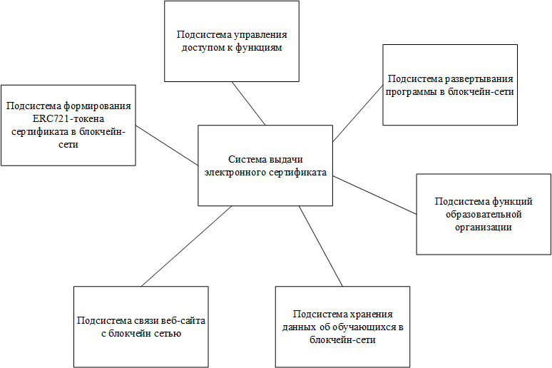
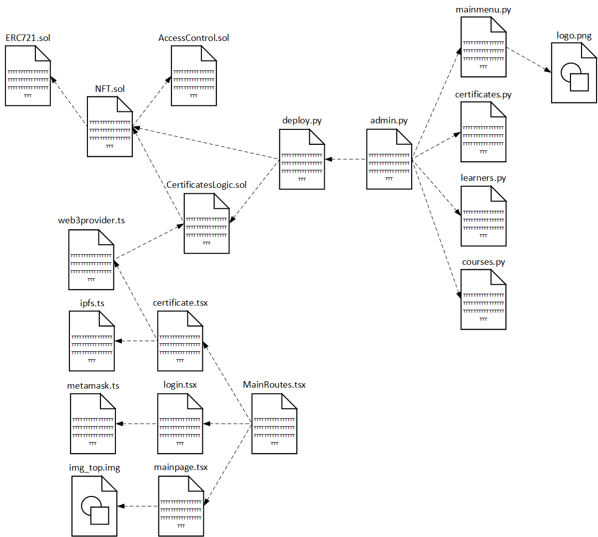

# Программная система выдачи электронных сертификатов

## Функционал

[Черновик_ТЗ_Лебедев.docx](Черновик_ТЗ_Лебедев.docx)

## Аналоги, критерии их оценки и сравнительный анализ с выработкой требований к системе

- 

## Структура системы и реализация ее компонентов

